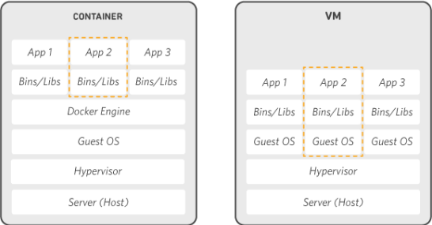

# Docker Tutorial - 0


## Docker Temelleri


##### Docker:
Docker, çoğunlukla uygulamaları geliştirmek, göndermek ve çalıştırmak için kullanılan açık kaynaklı bir teknolojidir.
Docker ile bir uygulamayı ve tüm bağımlılıklarını bir Docker çalıştırma konteynerine paketlediğinizde, herhangi bir ortamda çalışacağından emin olmanızdır. Ek olarak, Sanal Makineler (VM'ler) kullanırken kullandığınız platformun aksine, kullandığınız platform konusunda endişelenmenize gerek yoktur. Docker konteynerleri her yerde çalışır.Docker konteyneri, kodu ve tüm bağımlılıklarını depolayan standart bir yazılım birimidir, farklı ortamlarda hızlı ve güvenilir bir şekilde çalışır. Docker kapsayıcı görüntüsü, bir uygulamayı çalıştırmak için ihtiyacınız olan her şeye sahip olan hafif, bağımsız, yürütülebilir bir yazılım paketidir - kod, çalışma zamanı, sistem araçları, sistem kitaplıkları ve ayarlar.

Hem Linux hem de Windows tabanlı uygulamalar için mevcut olan konteynerli yazılım, altyapıdan bağımsız olarak her zaman aynı şekilde çalışır. Konteynerler, yazılımı ortamından izole eder ve farklılıklara rağmen tek tip olarak çalışmasını sağlar.


<code><a href="https://www.docker.com/" target="_blank"></a></code>

*Konteynerler* , imajların çalışır durumdaki halleridir.

*Docker Compose*, çoklu konteyner mimmarilerinin hazırlanması için kullanılan bir uygulamdır.

*Docker Machine*, docker konteynerlerinin sanal makinelerde dağıtılmasını ve yönetilmesini sağlayan bir araçtır.

*Docker Hub*, docker imajlarının saklanmasını ve dağıtılmasının sağlayan genel bir repo uygulamasıdır.

##### Docker Engine:
Docker Engine, uygulamalarınızı oluşturmak ve kaplamak için açık kaynaklı bir konteyner teknolojisidir. Dockerfile veya “docker-compose.yml” ‘den bilgileri alarak imajları oluşturur ve çalıştırır . Docker CLI üzerinden bir “docker” komutunu kullandığında yapılması gereken işlemleri yapması için Docker Engine ile iletişime geçer.


##### Docker vs Sanal Makineler:



VM (Virtual Machine)

    OS : Tam işletim sistemi
    İzolasyon : Yüksek
    Çalışır hale gelmesi : Dakikalar
    Versiyonlama : Yok
    Kolay paylaşılabilirlik : Düşük

Docker

    OS : Küçültülmüş işletim sistemi imajı
    İzolasyon : Daha düşük
    Çalışır hale gelmesi : Saniyeler
    Versiyonlama : Yüksek
    Kolay paylaşılabilirlik : Yüksek


### Docker Kurulum
<code><a href="https://www.centos.org/" target="_blank"></a></code>
<code><a href="https://www.ubuntu.com/" target="_blank"></a></code>
##### Linux - CentOS, Ubuntu
* Docker Community Edition sürümünün güncel halinin yüklenmesi
```sh
curl -sSL https://get.docker.com/ | sh
```
* Docker versiyon kontrolü
```sh
docker version
```
* Docker grubuna kullanıcı ekleme
```sh
sudo usermod -aG docker kullanici_adi
```
* Docker servisinin başlatılması
```sh
sudo systemctl start docker
```
* Docker Servisinin kontrolü
```sh
systemctl status docker
```
##### Docker Compose ve Docker Machine Kurulumu
* Debian
```sh
sudo apt install docker-compose
sudo apt install docker-machine
```
* CentOS
```sh
yum install docker-compose
yum install docker-machine
```


<code><a href="https://www.archlinux.org/" target="_blank"></a></code>
##### Arch Linux
* Docker, veri bloklarını sabit disk veya optik disk sürücüsü gibi fiziksel bir cihaza değil, normal bir dosyanın bloklarına eşleyen bir blok cihaz olan loop modülüne de bağlıdır
* Docker, kurulum sırasında döngü modülünü otomatik olarak etkinleştirmelidir. "loop" un bir çekirdek modülü olarak yüklenip yüklenmediğini kontrolü
```sh
lsmod | grep loop
```
* loop modülünü aktifleştirme
* ilk komut "loop" kelimesini soldaki komutun standart girişine, yani tee komutuna geçirir. Daha sonra tee "loop" kelimesini loop.conf dosyasına yazar. Modprobe komutu döngü modülünü Linux çekirdeğine ekler.
```sh
tee /etc/modules-load.d/loop.conf <<< "loop"
modprobe loop
```
* Docker Community Edition sürümünün kararlı halinin yüklenmesi
```sh
sudo pacman -Syu
sudo pacman -S docker
```
* Docker versiyon kontrolü
```sh
docker info
```
* Docker grubuna kullanıcı ekleme
```sh
sudo usermod -aG docker kullanici_adi
```
* Docker servisinin başlatılması
```sh
sudo systemctl start docker.service
```
* Docker servisinin aktif edilmesi
```sh
sudo systemctl enable docker.service
```
* Docker Servisinin kontrolü
```sh
systemctl status docker.service
```
* Docker Compose ve Docker Machine Kurulumu
```sh
sudo pacman -S docker-compose
sudo pacman -S docker-machine
```
